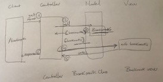

# User stories

As an internet user,
 So that I can easily return to the pages that are important to me,
 I want to be able to see the list of the pages that I've bookmarked.

As an internet user,
 So that I can easily find it later,
 I want to be able to bookmark the page that I'm reading.

## Domain Model

# Bookmark Manager

## How to use the app
clone this repository and then run
 $ bundle

## Set up the databases
Connect to psql

 $ psql postgres

Create the bookmark_manager and bookmark_manager_test databases:

 $ CREATE DATABASE bookmark_manager;
 $ CREATE DATABASE bookmark_manager_test;

To set up the appropriate tables, connect to each database and run each of the scripts in db/migrations folder in the given order.

To connect to the databases, run the following for each database:
 $ \c bookmark_manager;
 $ \c bookmark_manager_test;

## To run the Bookmark Manager app:
$ rackup

## To view bookmarks:

Navigate to localhost:9292

## To run tests:
$ rspec

## To run linting:
$ Rubocop
